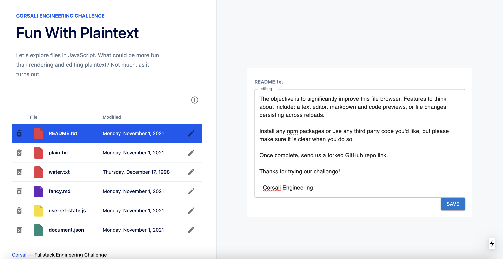
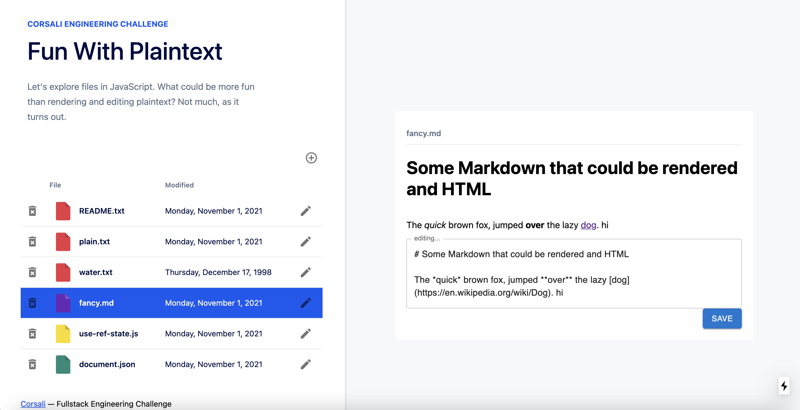
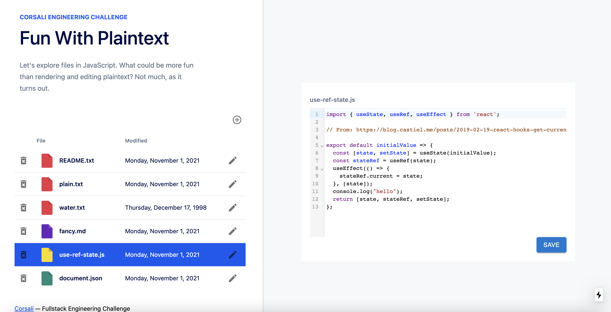
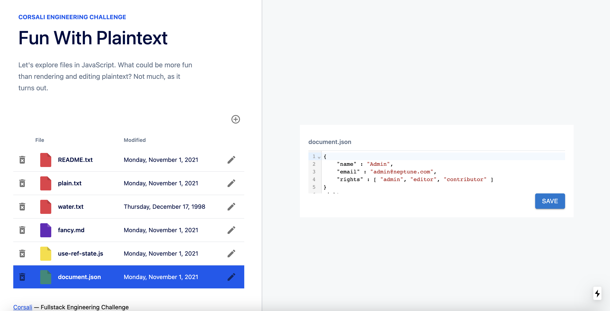
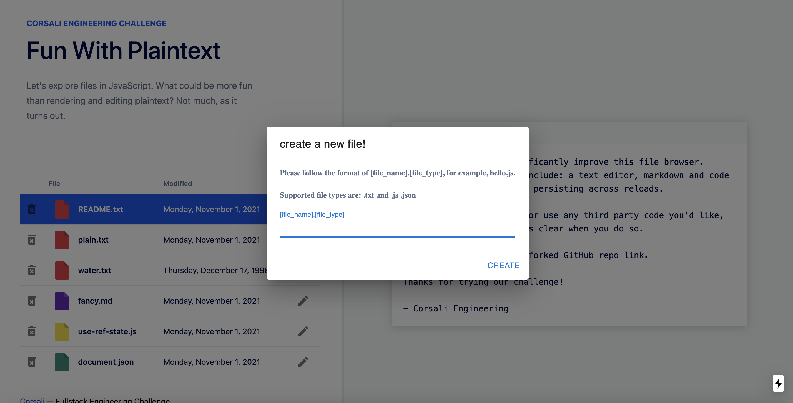

# Corsali Plaintext Editing

## Run the Project
- `npm install && npm run dev`
- open `localhost:3000` in your browser

## Dependencies 
Material UI: https://mui.com/   
React-Markdown: https://github.com/remarkjs/react-markdown  
React-CodeMirror: https://uiwjs.github.io/react-codemirror/

## Features Implemented
Supported file types: txt, md, js, json
* File Edit
    - toggle between preview and editing
    - customized UI for each file type
* File Save
    * save updated-but-not-saved file to browser's local storage for the purpose of persisting file changes across reloads
    * save button to save the file, update last modified time
    * a saved file is also persisting across reloads
        * to restore to the file's original content, delete the file info from browser's local storage
* Create File
    * create files with supported types
    * NOT persisting across reloads
* Delete File
    * delete any file 
    * NOT persisting across reloads

*the reason why file saving is persisting across reloads is beacuse we wouldn't want user to lose thier content if they accidentally reload the page before saving or if there's an error on the backend while saving the data; create/delete file, on the other hand, wouldn't make much sense since those require verification from the backend. Also, it's quite inefficient to get all the locally stored files from the browser, separate the saved from the created, and load those data into react state vairable for rendering.

## Future Improvements 
* There's a good amount of identical code in the file editor components. Exclude the rendering part, the operations are almost identical - useEffect that either load the file content from local storage or props,  function that save to browser's localStorage whenever there's a new edit, save button that updates the parent component's state variable *files*. 
    * an approach to solving this issue is to separate the rednering and the operations. Which would look something like: have a parent component that all the editior components share, the parent component would handle all the file-saving-updaing tasks while the children editor compents focus on rendering the editing UI.
    * Such approach is not implemented in this challenge because it'd go against the original structure of this project (as seen with REGISTERED_EDITORS in index.js) and does not take into account the possibilty of future custimzation for each file type. 
* Support more file types

Overall, I had a lot of fun so thanks for the challenge!  

## Project Screenshots

## Challenge Info
This is our frontend coding challenge. It gives us a chance to see your abilities and how you approach problems. It is designed to give you unlimited creative freedom as you develop a solution. Feel free to use any packages/tools/etc. you'd like to edit text as elegantly as possible. There are a variety of different file types to experiment with as you see fit.

To run the challenge:

- FORK this repo
- Download forked repo and run `npm install && npm run dev`
- Open `localhost:3000` in your browser
- Enjoy

Once complete, please email us a link to your forked repo with clean, tested code.

- Email fork link to: jobs@corsali.com or your current contact
- We will use Chrome to run it

